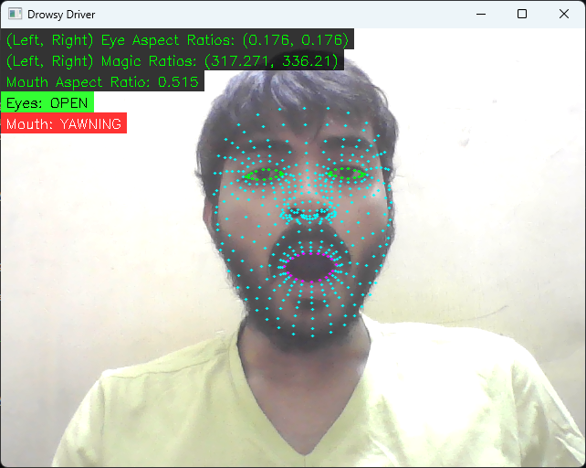

# Drowsy Driver

Driver drowsiness detection using facial landmanrks, and modified aspect ratios, with support for calibration of ratios according to the user.



### Running
- Clone
  ```bash
  git clone https://github.com/Eessh/drowsy-driver.git
  cd drowsy-driver
  ```
- Create virtual environment
  ```bash
  python -m venv venv
  ```
- Activate virtual environment
  - Windows
    ```powershell
    .\venv\Scripts\activate.bat
    ```
  - Unix (Linux/macOS)
    ```powershell
    ./venv/Scripts/activate
    ```
- Install required libraries
  ```bash
  pip install -r requirements.txt
  ```
- Run
  ```bash
  python src/main.py
  ```
